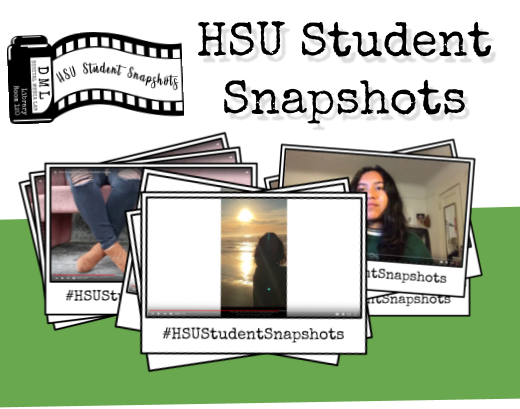

# Shooting Video &amp; Recording Audio

## HSU Student Snapshots
“Student Snapshots” is a collection of video stories from Humboldt State University (HSU) students in their own voice. These stories are about the experiences of students as they live in Humboldt County and explore both the county and the HSU campus. Student Snapshots are quick 1-minute stories that share your unique experience from your own vantage point. Take a look at the [HSU Student Snapshots YouTube playlist](https://www.youtube.com/playlist?list=PLe7DUUoET6mUN1jP4pO6uKW9uyubSkQhC) (below) to see what people have already shared and then add your story.

<iframe width="560" height="315" src="https://www.youtube-nocookie.com/embed/V0VFkAwyfTU?rel=0" frameborder="0" allow="autoplay; encrypted-media" allowfullscreen></iframe>

This guide will help you with planning and preparing your story. Visit the accompanying online guide for more links and info: [libguides.humboldt.edu/snapshots/learn](libguides.humboldt.edu/snapshots/learn).

## Digital Media Lab Quick Guide
This short guide will get you started with your project. For more information about this or with other digital media projects, visit [http://libguides.humboldt.edu/dml](http://libguides.humboldt.edu/dml).

## Storyboard
Fill out the storyboard with what you want to record in your scene. How will you frame the shot? Who will be in the shot? What kind of audio will you need to capture (voice, background sounds, background music)?

When planning your video project, you will want to think about: 
+ Equipment (camera, mic, props)
+ Environment (location, lighting, noise, traffic)
+ Footage (B-roll, where, what equipment, types of shots)

## Framing & Quick Tips:
### Portrait framing 
Use the Rule of Thirds is to place your subject in the frame asymmetrically. Picture lines in your frame breaking up the scene into three parts vertically and horizontally (nine sections in total). Place your subjects on the intersecting lines. For example:

### B-roll Shots
B-roll is alternative footage that you can use to supplement your main footage. B-roll is useful when you need extra footage and sound and is a good way to give a sense of scenery to your viewers or audience. Start your shots early and take extra shots or shoot your surroundings to gather B-roll footage.

### Be Prepared
Have an extra battery or a plan for charging your camera and/or audio recorder. 

Be sure to have enough space on the SD card or have a plan to offload your footage to a hard drive or computer between shoots.

Lastly, have a backup for audio. Use the camera or lavalier mic, but also record using a digital recorder or smartphone just in case something goes awry.

## Other useful links and resources:
### Editing software: 
+ HSU Campus: Camtasia is installed on campus. 
+ Mac: [iMovie](https://www.apple.com/imovie/) 
+ Windows: Story Remix 
+ Web-based: Adobe Spark (free with watermark at the end)
+ Phone Apps: 
    + GoPro Splice (iOS)
    + Adobe Spark (iOS, Android coming soon)

### Free Music available
+ [YouTube Audio Library](https://www.youtube.com/audiolibrary/music)
+ [Free Music Archive](http://freemusicarchive.org/)
+ [SoundCloud Creative Commons](https://soundcloud.com/wearecc)

### Camtasia Tutorials
+ [https://www.techsmith.com/tutorial-camtasia.html](https://www.techsmith.com/tutorial-camtasia.html)
+ Online SkillShop - [Getting Started with Camtasia](https://canvas.humboldt.edu/enroll/PCALYE)

### Digital Media Lab
+ [http://libguides.humboldt.edu/dml](http://libguides.humboldt.edu/dml)
+ Email dml@humboldt.edu for project consultations, equipment orientations or anything else!

### Access Humboldt Info
+ [Access Humboldt](http://www.accesshumboldt.net/site/learn) is a non-profit, community media organization serving the residents of Humboldt County. They offer workshops, studio space and equipment for rent.

---
For more info visit: [http://libguides.humboldt.edu/dml](http://libguides.humboldt.edu/dml) or email dml@humboldt.edu

This guide has an open [Creative Commons license](https://creativecommons.org/share-your-work/licensing-types-examples/). You can use, share, remix and repurpose this content as long as you attribute the authors, Jesse Garcia, Tim Miller &amp; Christina Cordova [CC BY](https://creativecommons.org/licenses/by/4.0/), 2018. If you’re re-using this guide, we’d love to hear about your project- dml@humboldt.edu.
